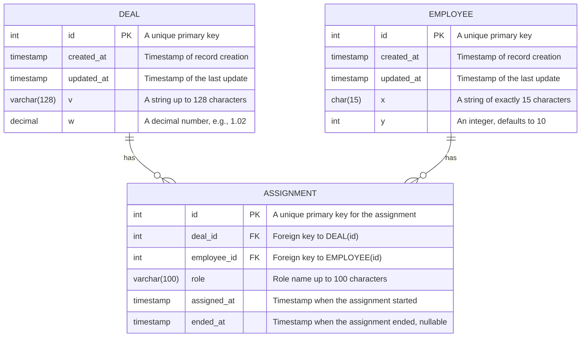

### Summary

This solution outlines a database schema designed to track assignments of employees to customer deals in various roles, with flexibility for future expansion of roles. The schema includes three tables: `deal`, `employee`, and `assignment`, with the latter serving as a junction table to manage the many-to-many relationships between deals and employees while capturing the roles assigned.

## Tables


#### Composite Keys and Additional Indexes

- **Composite Unique Key** in `assignment`: A composite unique key on (`deal_id`, `employee_id`, `role`, `assigned_at`) to prevent duplicate role assignments at the same time.
- **Indexes**:
  - Primary keys (`id` columns) in `deal` and `employee` tables are automatically indexed.
  - Additional indexes on `deal_id` and `employee_id` in the `assignment` table improve join operation performance.
  - An index on `role` in the `assignment` table could enhance filtering operations by role.

### Queries
#### Retrieve All Assignments for a Given Deal
To see all assignments for a specific deal, ordered by when the assignment started:

```sql
SELECT a.deal_id, a.employee_id, e.x as employee_name, a.role, a.assigned_at, a.ended_at
FROM assignment a
JOIN employee e ON a.employee_id = e.id
WHERE a.deal_id = ?  -- Replace '?' with a specific deal ID
ORDER BY a.assigned_at ASC;
```

#### Find Current and Historical Roles for an Employee
To see all deals and roles an employee is currently assigned to, as well as their historical assignments:
```sql
SELECT a.employee_id, a.deal_id, a.role, a.assigned_at, a.ended_at
FROM assignment a
WHERE a.employee_id = ?  -- Replace '?' with a specific employee ID
ORDER BY a.assigned_at DESC;
```

#### Adding a New Role to an Employee for a Deal
To assign a new role to an employee for a specific deal:
```sql
INSERT INTO assignment (deal_id, employee_id, role, assigned_at, created_at, updated_at)
VALUES (?, ?, ?, CURRENT_TIMESTAMP, CURRENT_TIMESTAMP, CURRENT_TIMESTAMP);
-- Replace '?' with specific deal_id, employee_id, and 'role' with the new role's name
```

#### Retrieve All Roles Assigned to a Deal
```sql
SELECT DISTINCT a.role
FROM assignment a
WHERE a.deal_id = ?  -- Replace '?' with a specific deal ID
ORDER BY a.role;
```

#### Update Assignment End Date
To mark an assignment as ended for an employee:

```sql
UPDATE assignment
SET ended_at = CURRENT_TIMESTAMP, updated_at = CURRENT_TIMESTAMP
WHERE employee_id = ? AND deal_id = ? AND role = ? AND ended_at IS NULL;
-- Replace '?' with specific employee_id, deal_id, and 'role'
```